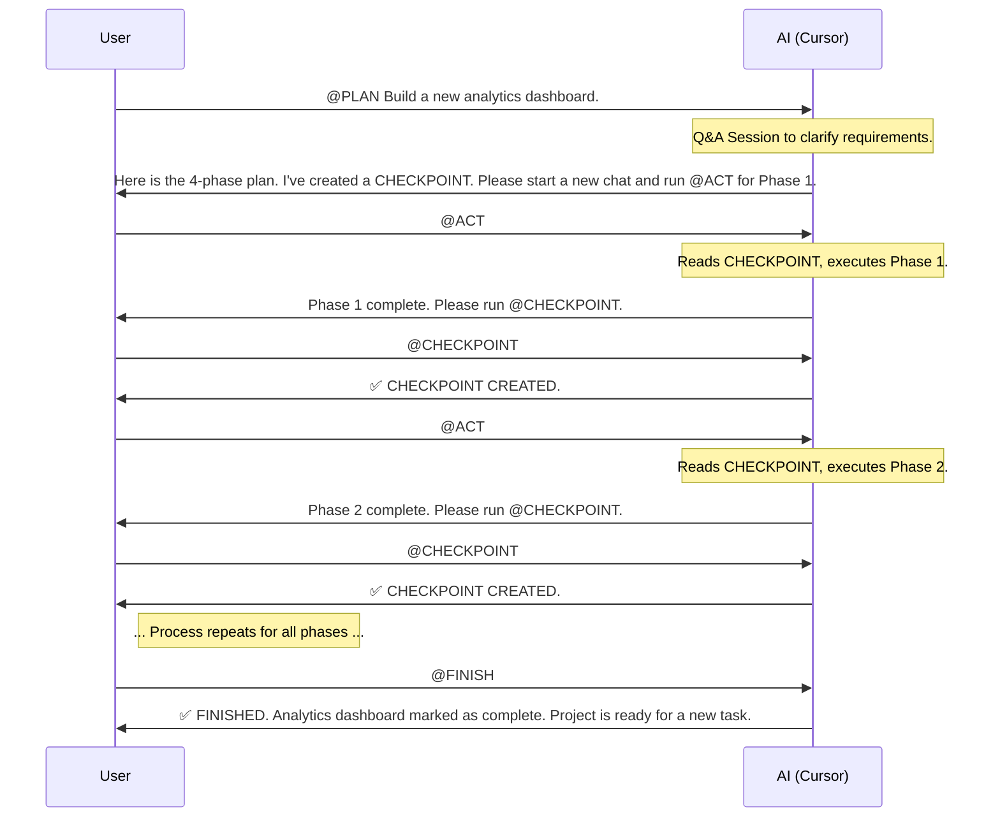

# 🤖 AI-Driven Development: The Phased-Execution Workflow Guide

This document outlines a structured methodology for collaborating with an AI assistant (like Cursor) on software development projects. The primary goal of this workflow is to overcome the inherent limitations of Large Language Models (LLMs), such as finite context windows and lack of session memory ("amnesia"), by establishing a robust, stateful, and predictable development process.

This system turns the AI from a simple "code generator" into a true development partner that can manage complex, multi-step tasks over extended periods.

## 📜 Core Philosophy

Our methodology is built on four key principles:

1.  🧠 **The Memory Bank is a Second Brain:** The AI's memory is volatile. We counteract this by maintaining a `Memory Bank` – a collection of Markdown files (`./.cursor/memory-bank/`) that serve as the project's persistent, long-term memory. The AI **must** consult this brain at the start of every session.
2.  🧩 **Divide and Conquer:** Large tasks are the enemy of limited context windows. All significant work is broken down into logical **Phases**. Each phase is designed to be small enough to be completed within a single, focused AI session.
3.  💾 **Checkpoints are Non-Negotiable:** State is managed explicitly. After a planning session or the completion of a development phase, a **Checkpoint** is created. This process saves the current state of work into the Memory Bank, ensuring no progress is lost and providing a clean starting point for the next phase.
4.  🗣️ **Humans Steer, AI Executes:** The workflow is designed to keep the developer in the driver's seat. The AI proposes plans, executes focused tasks, and manages documentation, but the developer gives the green light at every critical juncture.

---

## 🛠️ The Core Modes (Custom Rules)

Our workflow is orchestrated by a set of custom modes defined in `.cursor/modes.json`. Each mode assigns a specific role and set of instructions to the AI.

### `PLAN`
-   **🎯 Goal:** To transform a user request into a structured, multi-phase implementation plan.
-   **⚙️ Primary Function:** Acts as a software architect. It engages in a Q&A session to remove ambiguity and then produces a detailed plan broken down into context-friendly **Phases**.
-   **💡 Key Behavior:** For complex plans, it automatically creates a `CHECKPOINT` and recommends starting the execution (`ACT`) in a new chat window to ensure a clean context.

### `ACT`
-   **🎯 Goal:** To execute a single phase of an approved plan.
-   **⚙️ Primary Function:** Acts as a focused engineer. It reads the current context from the Memory Bank, implements **only one phase**, and documents its work.
-   **💡 Key Behavior:** It is strictly forbidden from starting the next phase. Its final, mandatory action is to propose running `CHECKPOINT` to save the new state.

### `CHECKPOINT`
-   **🎯 Goal:** To save the current state of the project to the Memory Bank.
-   **⚙️ Primary Function:** Acts as a meticulous archivist. It synthesizes the latest progress and updates the core context files (`activeContext.md`, `progress.md`).
-   **💡 Key Behavior:** Creates a "save game" state, clearly documenting what was just completed and what the *exact* next step is.

### `FINISH`
-   **🎯 Goal:** To formally close out a completed feature.
-   **⚙️ Primary Function:** Acts as a project finalizer. It cleans up the project's state after all phases are complete.
-   **💡 Key Behavior:** It archives the task in `progress.md`, resets the `activeContext.md` to a clean slate, and confirms that the project is ready for a new task.

### `STRATEGY_SESSION`
-   **🎯 Goal:** To conduct a deep-dive planning session for very large, complex epics (e.g., from a PRD).
-   **⚙️ Primary Function:** Acts as a Solutions Architect. It runs an extended, interactive discovery session before generating a highly detailed, multi-file plan.
-   **💡 Key Behavior:** Unlike `PLAN`, its primary output is a structured set of plan files in a new directory (`./ai/<plan-name>/`), designed for maximum clarity on massive features.

---

## 🌊 Workflows in Action

This system adapts to the size of the task.

### Large Task Workflow (Multi-Phase)

This is the most common workflow for new features. It ensures context is managed perfectly across multiple sessions.



### Medium & Small Task Workflows

-   **Medium Task:** `PLAN` -> `CHECKPOINT` -> `ACT` -> `FINISH`. For tasks that need a formal plan but can be executed in one go.
-   **Small Task:** `PLAN` -> `ACT`. For very simple tasks (e.g., fixing a typo) where the `PLAN` mode determines a checkpoint is unnecessary and asks for permission to `ACT` in the same window.

---

## 🏢 Multi-Repo Development: VS Code Workspaces

This methodology works seamlessly in a multi-repository setup using VS Code Workspaces, with a few key conventions.

**The Rule:** Each repository in the workspace is treated as an independent project and **must have its own Memory Bank** (`./.cursor/memory-bank/`).

**The Workflow:** When you start a planning session that involves a specific repository, you **must** provide that context in your initial prompt. This directs the AI to use the correct Memory Bank and file set.

**Example Prompt:**
`@PLAN Context: @my-api-repo. Let's add a new endpoint for user profiles.`

This tells the AI to focus its attention and Memory Bank operations exclusively on the `my-api-repo` directory.

```mermaid
graph TD
    A[VS Code Workspace] --> B[Repo A: my-frontend-app];
    A --> C[Repo B: my-api-repo];
    
    B --> B1[./.cursor/memory-bank];
    C --> C1[./.cursor/memory-bank];

    subgraph "Chat with AI"
        D[User Prompt: "@PLAN Context: @my-api-repo ..."] --> E{AI reads from C1};
    end

    style B1 fill:#e6f3ff,stroke:#333,stroke-width:2px
    style C1 fill:#e6f3ff,stroke:#333,stroke-width:2px
```

---

## ⚙️ Setup & Configuration

1.  Create a file named `modes.json` inside the `.cursor` directory of your project root.
2.  Copy the full content from the `modes.json` file provided in this repository into it.
3.  Configure the tools and models for each mode according to the table below for optimal performance.

### Configuration Table

| Mode | ⭐ Recommended Model | ✅ Enabled Tools | ❌ Disabled Tools |
| :--- | :--- | :--- | :--- |
| **`PLAN`** | **GPT-4o / Claude 3 Opus**| All `Search` tools | `Edit`, `Run` |
| **`ACT`** | **GPT-4o / Claude 3 Opus**| All `Search`, `Edit`, `Run`| - |
| **`CHECKPOINT`**| **Claude 3 Sonnet / Haiku**| `Read file`, `Edit & Reapply`| `Delete file`, `Run`, `Web`, `Codebase` |
| **`FINISH`** | **Claude 3 Sonnet / Haiku**| `Read file`, `Edit & Reapply`| `Delete file`, `Run`, `Web`, `Codebase` |
| **`STRATEGY_SESSION`**| **GPT-4o / Claude 3 Opus**| All `Search`, all `Edit` | `Run` |

This guide provides a comprehensive framework for a more powerful and reliable way of working with AI. By adhering to this process, you can tackle larger and more complex problems with confidence.
