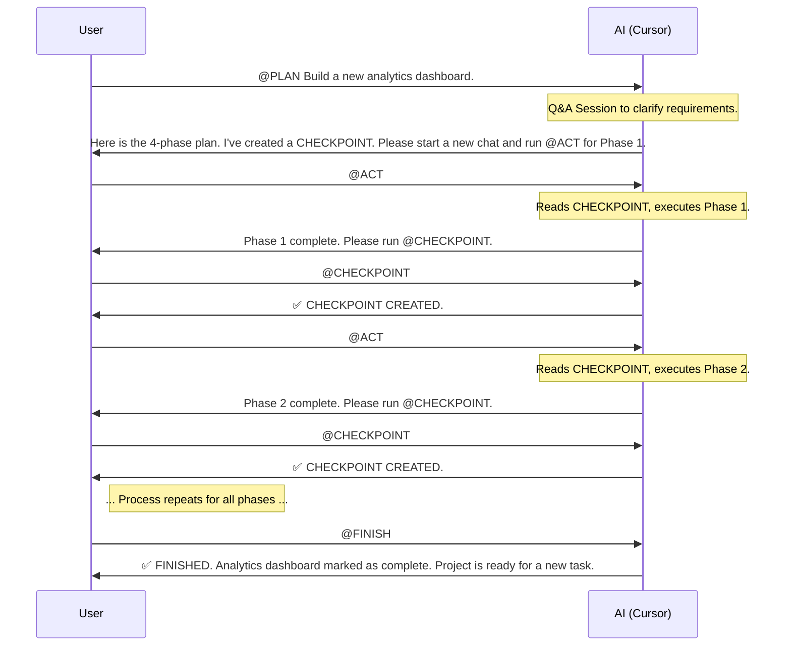
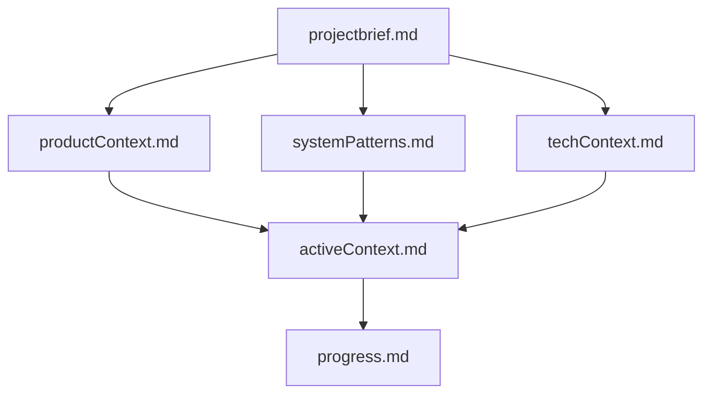
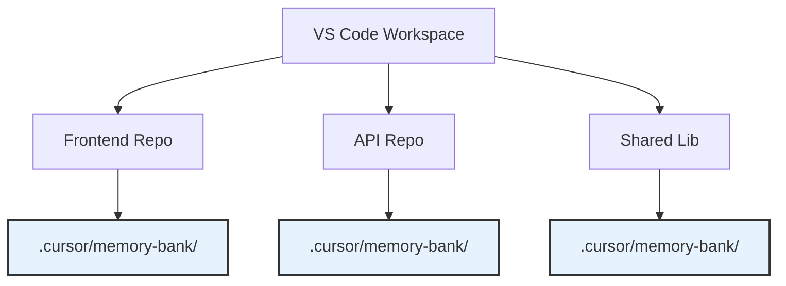
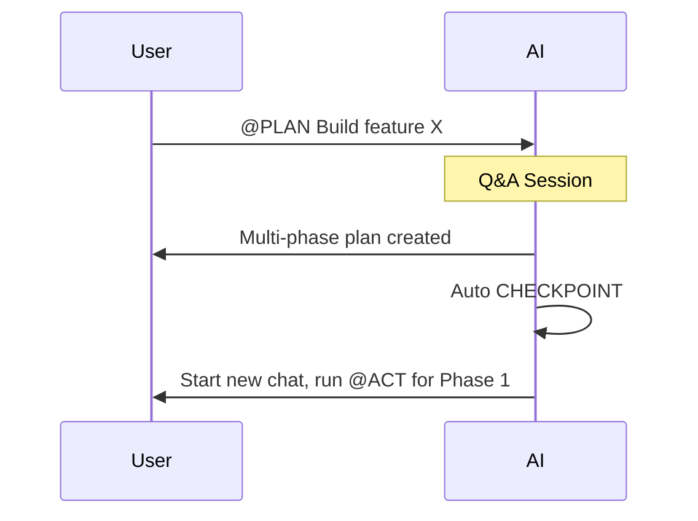
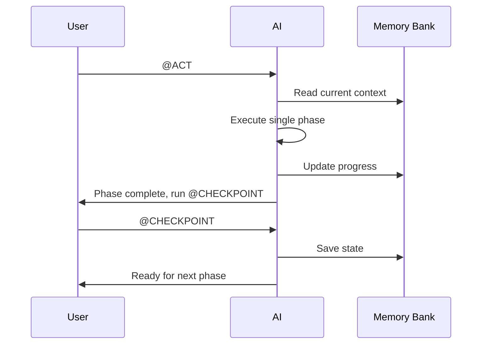

# 🤖 AI-Driven Development: The Phased-Execution Workflow Guide

This document outlines a structured methodology for collaborating with an AI assistant (like Cursor) on software development projects. The primary goal of this workflow is to overcome the inherent limitations of Large Language Models (LLMs), such as finite context windows and lack of session memory ("amnesia"), by establishing a robust, stateful, and predictable development process.

This system turns the AI from a simple "code generator" into a true development partner that can manage complex, multi-step tasks over extended periods.

## 📜 Core Philosophy

Our methodology is built on four key principles:

1.  🧠 **The Memory Bank is a Second Brain:** The AI's memory is volatile. We counteract this by maintaining a `Memory Bank` – a collection of Markdown files (`./.cursor/memory-bank/`) that serve as the project's persistent, long-term memory. The AI **must** consult this brain at the start of every session.
2.  🧩 **Divide and Conquer:** Large tasks are the enemy of limited context windows. All significant work is broken down into logical **Phases**. Each phase is designed to be small enough to be completed within a single, focused AI session.
3.  💾 **Checkpoints are Non-Negotiable:** State is managed explicitly. After a planning session or the completion of a development phase, a **Checkpoint** is created. This process saves the current state of work into the Memory Bank, ensuring no progress is lost and providing a clean starting point for the next phase.
4.  🗣️ **Humans Steer, AI Executes:** The workflow is designed to keep the developer in the driver's seat. The AI proposes plans, executes focused tasks, and manages documentation, but the developer gives the green light at every critical juncture.

---

## 🛠️ The Core Modes (Custom Rules)

Our workflow is orchestrated by a set of custom modes defined in `.cursor/modes.json`. Each mode assigns a specific role and set of instructions to the AI.

### `PLAN`
-   **🎯 Goal:** To transform a user request into a structured, multi-phase implementation plan.
-   **⚙️ Primary Function:** Acts as a software architect. It engages in a Q&A session to remove ambiguity and then produces a detailed plan broken down into context-friendly **Phases**.
-   **💡 Key Behavior:** For complex plans, it automatically creates a `CHECKPOINT` and recommends starting the execution (`ACT`) in a new chat window to ensure a clean context.

### `ACT`
-   **🎯 Goal:** To execute a single phase of an approved plan.
-   **⚙️ Primary Function:** Acts as a focused engineer. It reads the current context from the Memory Bank, implements **only one phase**, and documents its work.
-   **💡 Key Behavior:** It is strictly forbidden from starting the next phase. Its final, mandatory action is to propose running `CHECKPOINT` to save the new state.

### `CHECKPOINT`
-   **🎯 Goal:** To save the current state of the project to the Memory Bank.
-   **⚙️ Primary Function:** Acts as a meticulous archivist. It synthesizes the latest progress and updates the core context files (`activeContext.md`, `progress.md`).
-   **💡 Key Behavior:** Creates a "save game" state, clearly documenting what was just completed and what the *exact* next step is.

### `FINISH`
-   **🎯 Goal:** To formally close out a completed feature.
-   **⚙️ Primary Function:** Acts as a project finalizer. It cleans up the project's state after all phases are complete.
-   **💡 Key Behavior:** It archives the task in `progress.md`, resets the `activeContext.md` to a clean slate, and confirms that the project is ready for a new task.

### `STRATEGY_SESSION`
-   **🎯 Goal:** To conduct a deep-dive planning session for very large, complex epics (e.g., from a PRD).
-   **⚙️ Primary Function:** Acts as a Solutions Architect. It runs an extended, interactive discovery session before generating a highly detailed, multi-file plan.
-   **💡 Key Behavior:** Unlike `PLAN`, its primary output is a structured set of plan files in a new directory (`./ai/<plan-name>/`), designed for maximum clarity on massive features.

---

## 🌊 Workflows in Action

This system adapts to the size of the task.

### Large Task Workflow (Multi-Phase)

This is the most common workflow for new features. It ensures context is managed perfectly across multiple sessions.



# Cursor Smart Modes

[](https://choosealicense.com/licenses/mit/)

A comprehensive framework for AI-driven development using Cursor's custom modes. This system transforms Cursor from a simple code generator into a true development partner capable of managing complex, multi-phase projects with persistent memory and structured workflows.

## 🎯 Genesis

This project was born from practical experience with various AI development tools. After working with solutions like roo.cline and Cline, I was inspired to create a similar workflow system for Cursor. 

The challenge with Cursor's cost-effective approach is how it handles context window compression and truncation. This often leads to degraded results when working on larger tasks. The solution? A phased development approach that operates on smaller code sections while maintaining detailed, step-by-step planning. This approach results in:

- **Reduced context window usage** = Less compression = Better results
- **Persistent project memory** across sessions
- **Structured, manageable development phases**

## 🚀 Quick Start

### 1. Memory Bank Initialization

Create the Memory Bank structure in your project:

```bash
mkdir -p .cursor/memory-bank
```

Copy the content from [`memory-bank.md`](./memory-bank.md) and initialize your project's memory bank files as needed.

### 2. Install Custom Modes

1. Copy [`.cursor/modes.json`](./.cursor/modes.json) to your project's `.cursor/` directory
2. Review the individual mode files in [`/modes/`](./modes/) for detailed explanations
3. Configure Cursor according to the [Configuration Table](#configuration-table) below

### 3. Start Using Modes

In any Cursor chat, simply type:
- `@PLAN` - Plan a new feature or task
- `@ACT` - Execute a single phase of work  
- `@CHECKPOINT` - Save current state
- `@FINISH` - Close out completed work
- `@STRATEGY_SESSION` - Deep planning for complex features

## 🧠 Memory Bank System

> **Note:** The Memory Bank concept originates from [this excellent gist](https://gist.github.com/ipenywis/1bdb541c3a612dbac4a14e1e3f4341ab) by @ipenywis.

The Memory Bank is Cursor's persistent memory system - a collection of Markdown files that maintain project context across sessions. Since AI memory resets between sessions, this documentation becomes the project's "second brain."

### Memory Bank Structure



### Core Files

| File | Purpose |
|------|---------|
| `projectbrief.md` | Foundation document defining core requirements and project scope |
| `productContext.md` | Why the project exists, problems it solves, user experience goals |
| `activeContext.md` | Current work focus, recent changes, next steps |
| `systemPatterns.md` | System architecture, technical decisions, design patterns |
| `techContext.md` | Technologies used, development setup, constraints |
| `progress.md` | What works, what's left to build, current status, known issues |

## 🛠️ Core Modes

Our workflow uses five specialized modes, each with a specific role:

### PLAN Mode
**Goal:** Transform user requests into structured, multi-phase implementation plans
- Conducts Q&A sessions to clarify requirements
- Breaks down complex tasks into manageable phases
- Automatically creates checkpoints for multi-phase plans

### ACT Mode  
**Goal:** Execute a single phase of an existing plan
- Reads Memory Bank to understand current context
- Implements ONLY the current phase
- Documents work and proposes checkpoint

### CHECKPOINT Mode
**Goal:** Save current project state to Memory Bank
- Creates a "save game" state of all progress
- Updates `activeContext.md` and `progress.md`
- Ensures seamless continuation in future sessions

### FINISH Mode
**Goal:** Formally close out completed features
- Archives completed work in `progress.md`
- Resets `activeContext.md` for new tasks
- Confirms project is ready for next assignment

### STRATEGY_SESSION Mode
**Goal:** Deep-dive planning for large, complex features
- Extended interactive discovery sessions
- Generates detailed multi-file implementation plans
- Creates structured plan directories for maximum clarity

## 📋 Configuration Table

Configure each mode in Cursor's settings as follows:

| Mode | Recommended Model | Enable in Cursor | Disable in Cursor |
|------|------------------|------------------|-------------------|
| **PLAN** | GPT-4o / Claude 3 Opus | ✅ Search, Web, Codebase, List directory, Search files, Read file, Fetch rules | ❌ Edit & Reapply, Delete file, Terminal, Run |
| **ACT** | GPT-4o / Claude 3 Opus | ✅ Search, Web, Codebase, List directory, Search files, Read file, Fetch rules, Edit & Reapply, Terminal | ❌ Delete file |
| **CHECKPOINT** | Claude 3 Sonnet / Haiku | ✅ Read file, Edit & Reapply | ❌ Delete file, Terminal, Run, Web, Codebase |
| **FINISH** | Claude 3 Sonnet / Haiku | ✅ Read file, Edit & Reapply | ❌ Delete file, Terminal, Run, Web, Codebase |
| **STRATEGY_SESSION** | GPT-4o / Claude 3 Opus | ✅ Search, Web, Codebase, List directory, Search files, Read file, Fetch rules, Edit & Reapply | ❌ Terminal, Run |

*Based on Cursor's tool categories as shown in the settings panel*

## 🌊 Workflow Examples

### Large Task (Multi-Phase)
```
@PLAN → CHECKPOINT → [New Chat] @ACT → @CHECKPOINT → [New Chat] @ACT → ... → @FINISH
```

**Key Points:**
- Always start new chats for each ACT phase to maintain clean context
- CHECKPOINT can be run in the same chat immediately after ACT
- Important information persists in Memory Bank between sessions

### Medium Task  
```
@PLAN → @CHECKPOINT → [New Chat] @ACT → @FINISH
```
For tasks needing formal planning but executable in one phase.

### Small Task
```
@PLAN → @ACT
```
For simple tasks where PLAN determines no checkpoint needed.

### Important: New Chat Best Practices

🔄 **Always start a new chat when:**
- Beginning a new ACT phase
- Moving between major workflow steps

✅ **Same chat is OK for:**
- Running CHECKPOINT immediately after ACT
- Quick clarifications within the same phase

This ensures the Memory Bank maintains state while keeping each execution context clean and focused.

## 🏢 Multi-Repository Support

When working with VS Code Workspaces containing multiple repositories:

1. **Each repository needs its own Memory Bank** (`.cursor/memory-bank/`)
2. **Specify context in prompts:** `@PLAN Context: @my-api-repo. Add user authentication.`
3. **AI focuses exclusively** on the specified repository's Memory Bank



## 📁 Repository Structure

```
cursor-smart-modes/
├── .cursor/
│   └── modes.json              # Mode definitions for Cursor
├── modes/                      # Human-readable mode documentation
│   ├── PLAN.mdc
│   ├── ACT.mdc  
│   ├── CHECKPOINT.mdc
│   ├── FINISH.mdc
│   └── STRATEGY_SESSION.mdc
├── memory-bank.md              # Memory Bank documentation
├── README.md                   # This file
└── LICENSE                     # MIT License
```

## 🔄 Workflow Diagrams

### Planning & Checkpoint Cycle


### Iterative Development Loop  


## 🤝 Contributing

Contributions are welcome! Please feel free to submit a Pull Request.

## 📄 License

This project is licensed under the MIT License - see the [LICENSE](LICENSE) file for details.

---

**Built with ❤️ for the Cursor community**
