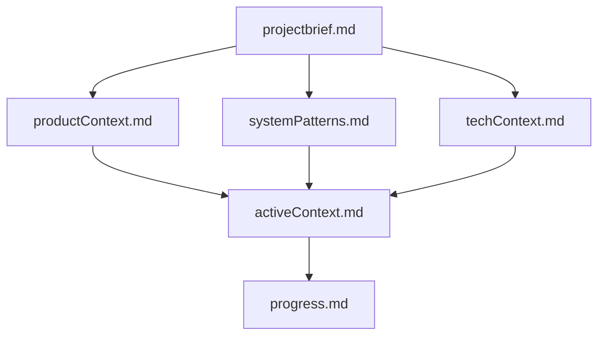
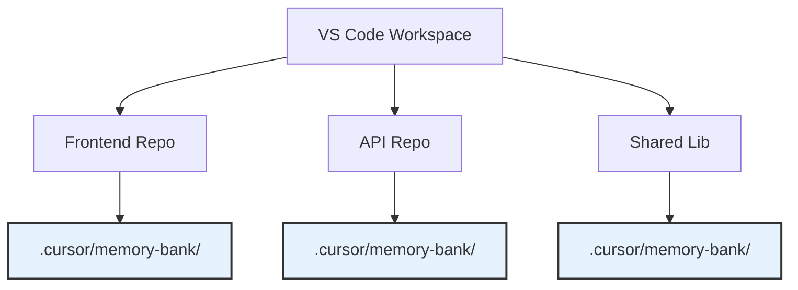
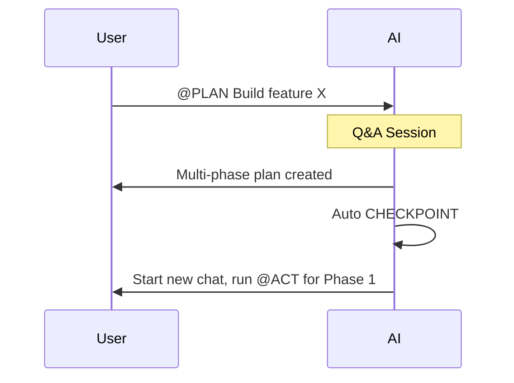
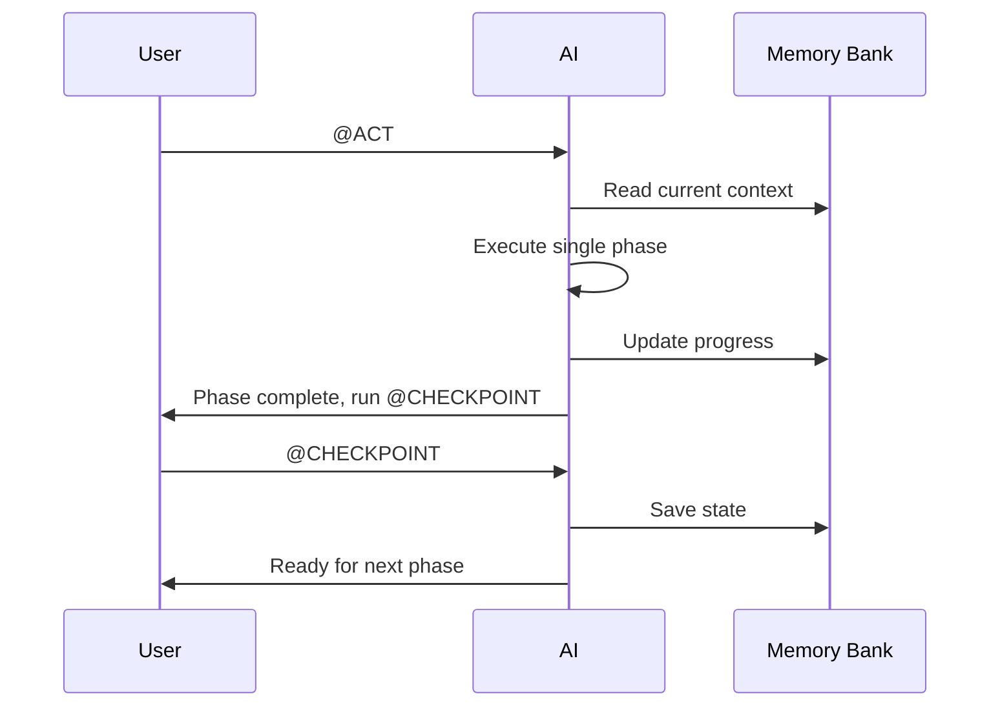

 # Cursor Smart Modes

[](https://choosealicense.com/licenses/mit/)

A comprehensive framework for AI-driven development using Cursor's custom modes. This system transforms Cursor from a simple code generator into a true development partner capable of managing complex, multi-phase projects with persistent memory and structured workflows.

## 🎯 Genesis

This project was born from practical experience with various AI development tools. After working with solutions like roo.cline and Cline, I was inspired to create a similar workflow system for Cursor. 

The challenge with Cursor's cost-effective approach is how it handles context window compression and truncation. This often leads to degraded results when working on larger tasks. The solution? A phased development approach that operates on smaller code sections while maintaining detailed, step-by-step planning. This approach results in:

- **Reduced context window usage** = Less compression = Better results
- **Persistent project memory** across sessions
- **Structured, manageable development phases**

## 🚀 Quick Start

### 1. Memory Bank Initialization

Copy the content from [`memory-bank.md`](./memory-bank.md) and follow these steps:

1. **Add to Cursor User Rules**: Go to Cursor Settings → Rules → User Rules and paste the entire content of the `memory-bank.md` file
2. **Initialize via AGENT mode**: In any Cursor chat, switch to AGENT mode and type "initialize memory bank"

Memory bank initialization happens automatically when you type 'initialize memory bank' in AGENT mode, provided the memory-bank.md content has already been added to User Rules.

### 2. Setup Custom Modes

1. Review the individual mode files in [`/modes/`](./modes/) for detailed explanations
2. Configure Cursor according to the [Configuration Table](#configuration-table) below

### 3. Start Using Modes

In any Cursor chat, simply type:
- `@PLAN` - Plan a new feature or task
- `@ACT` - Execute a single phase of work  
- `@CHECKPOINT` - Save current state
- `@FINISH` - Close out completed work
- `@STRATEGY_SESSION` - Deep planning for complex features

## 🧠 Memory Bank System

> **Note:** The Memory Bank concept originates from [this excellent gist](https://gist.github.com/ipenywis/1bdb541c3a612dbac4a14e1e3f4341ab) by @ipenywis.

The Memory Bank is Cursor's persistent memory system - a collection of Markdown files that maintain project context across sessions. Since AI memory resets between sessions, this documentation becomes the project's "second brain."

### Memory Bank Structure



### Core Files

| File | Purpose |
|------|---------|
| `projectbrief.md` | Foundation document defining core requirements and project scope |
| `productContext.md` | Why the project exists, problems it solves, user experience goals |
| `activeContext.md` | Current work focus, recent changes, next steps |
| `systemPatterns.md` | System architecture, technical decisions, design patterns |
| `techContext.md` | Technologies used, development setup, constraints |
| `progress.md` | What works, what's left to build, current status, known issues |

## 🛠️ Core Modes

Our workflow uses five specialized modes, each with a specific role:

### PLAN Mode
**Goal:** Transform user requests into structured, multi-phase implementation plans
- Conducts Q&A sessions to clarify requirements
- Breaks down complex tasks into manageable phases
- Automatically creates checkpoints for multi-phase plans

### ACT Mode  
**Goal:** Execute a single phase of an existing plan
- Reads Memory Bank to understand current context
- Implements ONLY the current phase
- Documents work and proposes checkpoint

### CHECKPOINT Mode
**Goal:** Save current project state to Memory Bank
- Creates a "save game" state of all progress
- Updates `activeContext.md` and `progress.md`
- Ensures seamless continuation in future sessions

### FINISH Mode
**Goal:** Formally close out completed features
- Archives completed work in `progress.md`
- Resets `activeContext.md` for new tasks
- Confirms project is ready for next assignment

### STRATEGY_SESSION Mode
**Goal:** Deep-dive planning for large, complex features
- Extended interactive discovery sessions
- Generates detailed multi-file implementation plans
- Creates structured plan directories for maximum clarity

## 📋 Configuration Table

Configure each mode in Cursor's settings as follows:

| Mode | Recommended Model | Enable in Cursor | Disable in Cursor |
|------|------------------|------------------|-------------------|
| **📋 PLAN** | GPT-o3, Claude 4 Thinking, Gemini 2.5 Pro | ✅ **Search** (entire category)<br>✅ **Read file, Fetch rules** | ❌ **Edit** (entire category)<br>❌ **Run** (entire category)<br>❌ **MCP** (servers) |
| **⚡ ACT** | Claude 4, GPT-4.1 | ✅ **Search** (entire category)<br>✅ **Edit** (entire category)<br>✅ **Run** (entire category) | ❔ **MCP** (only if needed) |
| **💾 CHECKPOINT** | Auto / Claude 4, GPT-4.1 | ✅ **Read file, Fetch rules**<br>✅ **Edit** (entire category) | ❌ **Run** (entire category)<br>❌ **MCP** (servers)<br>❌ **Web, Codebase** |
| **✅ FINISH** | Auto / Claude 4, GPT-4.1 | ✅ **Read file, List directory, Search files, Grep**<br>✅ **Edit & Reapply** | ❌ **Delete file**<br>❌ **Run** (entire category)<br>❌ **MCP** (servers)<br>❌ **Codebase, Web** |
| **🧠 STRATEGY_SESSION** | GPT-o3, Claude 4 Thinking, Gemini 2.5 Pro | ✅ **Search** (entire category)<br>✅ **Edit** (entire category) | ❌ **Run** (entire category) |

### Detailed Tool Configuration

**📋 PLAN Mode** - Deep analysis without making changes:
- **✅ Search Category**: Codebase analysis, Web research, Grep/Search files for dependencies, List directory for structure navigation, Read file for Memory Bank and code analysis, Fetch rules for understanding existing patterns
- **❌ Edit Category**: Prevention against accidental modifications during planning phase
- **❌ Run Category**: No terminal commands needed for planning
- **❌ MCP**: Not relevant for planning phase

**⚡ ACT Mode** - Full implementation capabilities:
- **✅ Search Category**: Continued need for reading files, finding definitions, and web research during implementation
- **✅ Edit Category**: Core functionality for writing and modifying code
- **✅ Run Category**: Essential for testing, installing dependencies, compilation, and running development servers
- **❔ MCP**: Enable only if your project requires server operations

**💾 CHECKPOINT Mode** - Focused state saving:
- **✅ Limited Search**: Only Read file and Fetch rules needed for reviewing files to update
- **✅ Edit Category**: Essential for updating Memory Bank files (.md and .cursorrules)
- **❌ Run Category**: State saving doesn't require terminal operations
- **❌ Web/Codebase**: Not needed for summarization tasks

**✅ FINISH Mode** - Clean Memory Bank operations:
- **✅ Selective Search**: Read file (essential), List directory/Search files/Grep (helpful for locating files), but exclude Codebase/Web (work is already complete)
- **✅ Edit & Reapply**: Critical for updating progress.md and activeContext.md
- **❌ Delete file**: Safety measure against accidental file deletion
- **❌ Run Category**: Finalization doesn't require terminal commands

**🧠 STRATEGY_SESSION Mode** - Comprehensive planning:
- **✅ Search Category**: Essential for Q&A phase and thorough analysis
- **✅ Edit Category**: Required for generating detailed implementation plans
- **❌ Run Category**: Planning doesn't require terminal operations

*Based on Cursor's tool categories as shown in the settings panel*

## 🌊 Workflow Examples

### Large Task (Multi-Phase)
```
@PLAN → [New Chat] @ACT → @CHECKPOINT → [New Chat] @ACT → ... → @FINISH
```

**Key Points:**
- Always start new chats for each ACT phase to maintain clean context
- CHECKPOINT can be run in the same chat immediately after ACT
- Important information persists in Memory Bank between sessions

### Medium Task  
```
@PLAN → [New Chat] @ACT → @FINISH
```
For tasks needing formal planning but executable in one phase.

### Small Task
```
@PLAN → @ACT
```
For simple tasks where PLAN determines no checkpoint needed.

### Important: New Chat Best Practices

🔄 **Always start a new chat when:**
- Beginning a new ACT phase
- Moving between major workflow steps

✅ **Same chat is OK for:**
- Running CHECKPOINT immediately after ACT
- Quick clarifications within the same phase

This ensures the Memory Bank maintains state while keeping each execution context clean and focused.

## 🏢 Multi-Repository Support

When working with VS Code Workspaces containing multiple repositories:

1. **Each repository needs its own Memory Bank** (`.cursor/memory-bank/`)
2. **Specify context in prompts:** `@PLAN Context: @my-api-repo. Add user authentication.`
3. **AI focuses exclusively** on the specified repository's Memory Bank



## 🔄 Workflow Diagrams

### Planning & Checkpoint Cycle


### Iterative Development Loop  


## 🤝 Contributing

Contributions are welcome! Please feel free to submit a Pull Request.

## 📄 License

This project is licensed under the MIT License - see the [LICENSE](LICENSE) file for details.

---

**Built with ❤️ for the Cursor community**
